#

**Matteo Francia**

- Ricercatore presso DISI - Università di Bologna
- Contatto: m.francia@unibo.it

**Background principale**:

- Dottorato in *Ingegneria e Scienze Informatiche*
- Big data e machine learning
    - ... con *applicazioni* nel campo dell'Agricoltura di Precisione
    - *L'interdisciplinarità* è molto importante!

Queste slide sono il risultato di uno sforzo condiviso:

- **Brevetto**: "Metodo e Sistema per il Monitoraggio dell'Umidità del Suolo" registrato il 18 ottobre 2023 N. 102021000023162
- **Ricerca**: "Multi-sensor profiling for precision soil-moisture monitoring" [@francia2022multi]
- Grazie a Prof. Matteo Golfarelli, Dott. Manuele Pasini, Dott. Alex Baiardi

# Irrigazione Intelligente

:::: {.columns}
::: {.column width="62%"}

La sinergia tra Internet of Things (IoT) e agricoltura di precisione produce applicazioni di valore [@vitali2021crop]

- **Agritech**: uso della tecnologia in agricoltura per migliorare efficienza e redditività

**Obiettivo**

- Ottimizzare l'umidità del suolo è cruciale per le prestazioni delle colture [@turkeltaub2016real]
- Risparmiare acqua migliorando la qualità della frutta (cioè fornire una raccomandazione sulla quantità d'acqua necessaria)

(Alcuni) **Problemi**:

- *I suoli* hanno differenti capacità di trattenere l'acqua
- *I sistemi di irrigazione* hanno comportamenti diversi
    - Gocciolatori vs irrigatori
- *Le piante* hanno diverse esigenze idriche
    - Kiwi [@judd1986water] vs Uva

:::
::: {.column width="33%"}

</img>

:::
::::

# Scenario di riferimento

:::: {.columns}
::: {.column width="58%"}

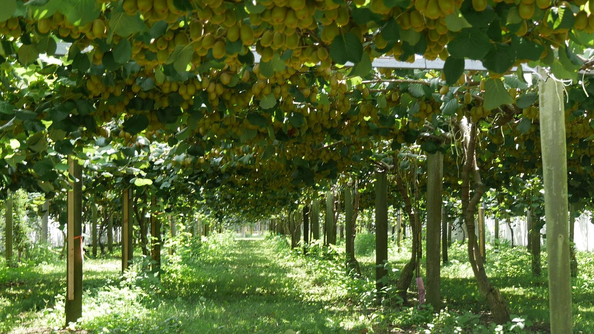

:::
::: {.column width="42%"}

:::
::::

Il nostro approccio si concentra su frutteti

- Le *piante di kiwi sono allineate lungo i filari*
- Ogni filare ha molti *gocciolatori* (es. 1 ogni 60cm)
- I gocciolatori possono irrigare solo un *volume limitato di suolo*

# Panoramica dell'Approccio

:::: {.columns}
::: {.column width="50%"}

Il nostro approccio si compone di due fasi:

- **Monitoraggio**: comprendere il comportamento del suolo
- **Prescrizione**: fornire la quantità ottimale d'acqua

... coinvolge due attori:

- *Agricoltore*: fornisce conoscenze sul campo e feedback giornalieri
- *Tecnico*: definisce lo stato ottimale e verifica il comportamento del sistema

... e richiede un ambiente IoT:

- *Sensori* (obbligatori): forniscono conoscenze in tempo reale
- *Pompa d'acqua azionabile*: abilita l'irrigazione intelligente
    - Senza connessione remota, forniamo all'agricoltore una raccomandazione (es. via e-mail)

:::
::: {.column width="50%"}

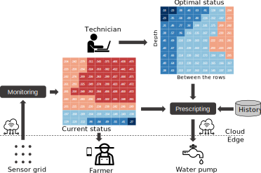

:::
::::

# Monitoraggio

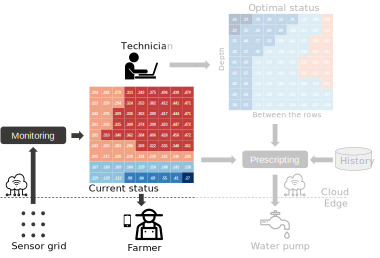

# Dai Sensori ai Profili del Suolo

:::: {.columns}
::: {.column width="32%"}

:::
::: {.column width="32%"}

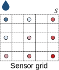

:::
::: {.column width="32%"}

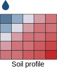

:::
::::

1. L'umidità del suolo è un continuum nel terreno
1. I sensori restituiscono una rappresentazione discretizzata dell'umidità del suolo
    - A seconda del numero di sensori e del loro layout, l'accuratezza del monitoraggio cambia
1. Obiettivo: produrre profili del suolo dettagliati a partire da layout a grana grossa

# Layout dei Sensori e Ipotesi di Simmetria

Approcci con singolo sensore (o colonna di sensori a diverse profondità) assumono che l'umidità del suolo sia uniforme ovunque

:::: {.columns}
::: {.column width="50%"}

:::
::: {.column width="50%"}

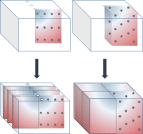

:::
::::

- Se il volume irrigato è simmetrico lungo il filare, una griglia 2D di sensori è sufficiente per rappresentare il volume di suolo
- Se le variazioni di umidità avvengono anche lungo il filare, è necessaria una griglia 3D di sensori
    - Es. gocciolatori troppo distanti tra loro

# Raccolta Dati

:::: {.columns}
::: {.column width="60%"}

**Setup**: installiamo una griglia 2D di sensori

- 4 colonne di sensori disposte lungo il filare (es. 0/30/60/90cm)
    - La colonna (0, *) è sotto il gocciolatore
- Ogni colonna ha 3 sensori a diverse profondità (es. 20/40/60cm)

**Dataset**: In quattro anni, abbiamo raccolto 70GB di dati (al 30 agosto 2024)

:::
::: {.column width="40%"}

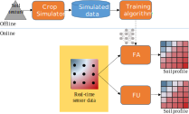

:::
::::

# Elaborazione  

:::: {.columns}  
::: {.column width="60%"}  

Interpolazione dei dati del sensore in tempo reale

**Tecniche statistiche (FU)**  

- Plug-and-play (funzionante dal primo giorno)  

**Tecniche basate su intelligenza artificiale (FA)**  

- Richiede tempo per la raccolta dati e l'addestramento/test

:::  
::: {.column width="40%"}  

  

:::  
::::  

# Fase Online: Profilazione Statistica

Profilazione dei dati dei sensori in tempo reale attraverso **tecniche statistiche**  

- Interpolazione lineare dei dati dei sensori in tempo reale  
- Plug-and-play (funzionante dal primo giorno)  

  

# Fase Offline: Profilazione con IA

  

Si tratta di un **problema di regressione (multi-output)**  

- Il compito è *apprendere la funzione che mappa l'input con l'output continuo*  
- Abbiamo provato diversi modelli di machine learning  
    - SVR, Random Forest Regression, Regressione Lineare e ANN  

# Reti Neurali Artificiali  

*(Una semplice) ANN è il modello con le migliori prestazioni*  

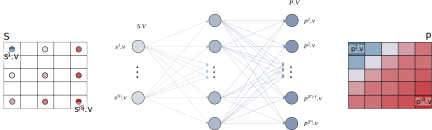  

Gli iperparametri (struttura/tassi di apprendimento) vengono impostati tramite un processo di ottimizzazione  

- *HyperOpt* [@komer2019hyperopt]: tecnica di ottimizzazione per esplorare lo spazio di ricerca degli iperparametri  
- Stiamo nidificando machine learning nel machine learning!  

# Confronto tra Approcci Statistici e con IA

:::: {.columns}  
::: {.column width="50%"}  

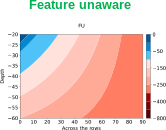  

:::  
::: {.column width="50%"}  

  

:::  
::::

# Monitoraggio

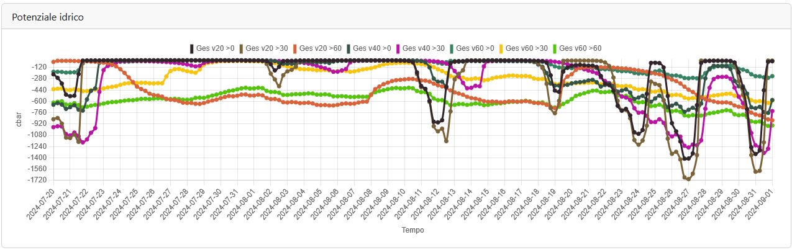  

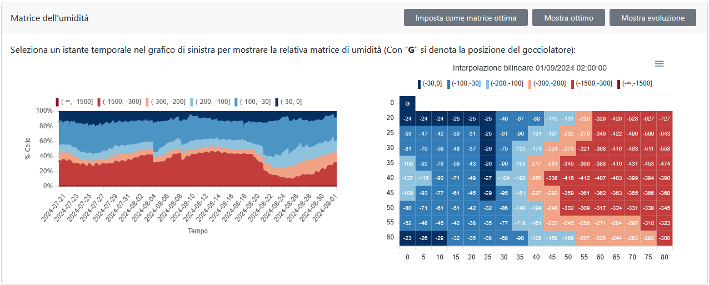

# Monitoraggio



# Irrigazione Intelligente

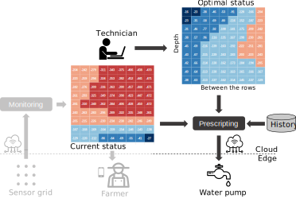  

# Irrigazione Intelligente

Il tecnico imposta un'umidità del suolo ottimale e il sistema deve raggiungerla  [@quartieri2021effect]  

:::: {.columns}  
::: {.column width="50%"}  

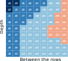  

:::  
::: {.column width="50%"}  

- **Rosso**: stato ottimale  
- *Blu*: stato attuale  

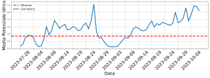  

:::  
::::  

# Consumo Idrico  

:::: {.columns}  
::: {.column width="50%"}  

Irrigazione prescrittiva

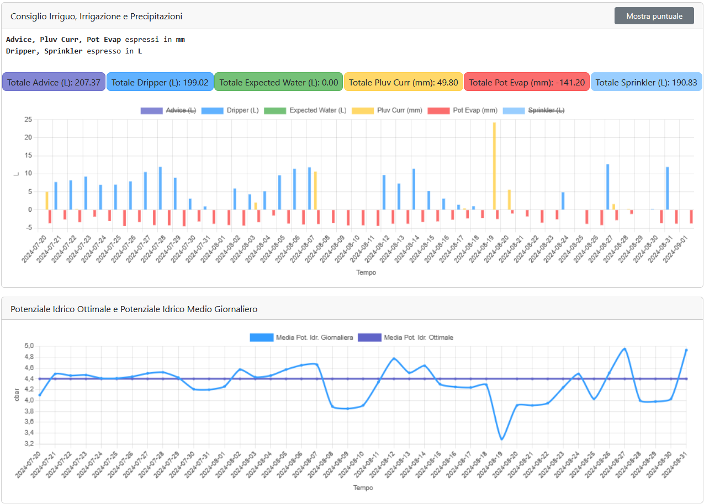  

:::  
::: {.column width="50%"}  

Agricoltore

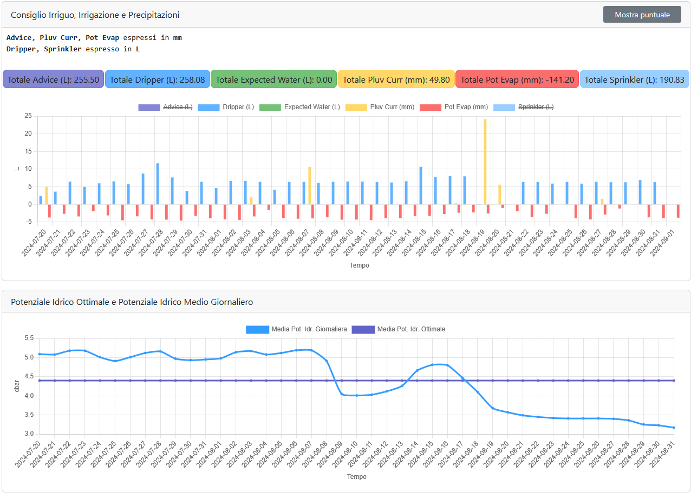  

:::  
::::  

- *Risparmio del 40%* di acqua durante l'intera campagna (24% in luglio/agosto)
- *Costi energetici ridotti*: meno ore di funzionamento della pompa  
- *Qualità comparabile* del frutto rispetto alla gestione manuale  

# Bibliografia